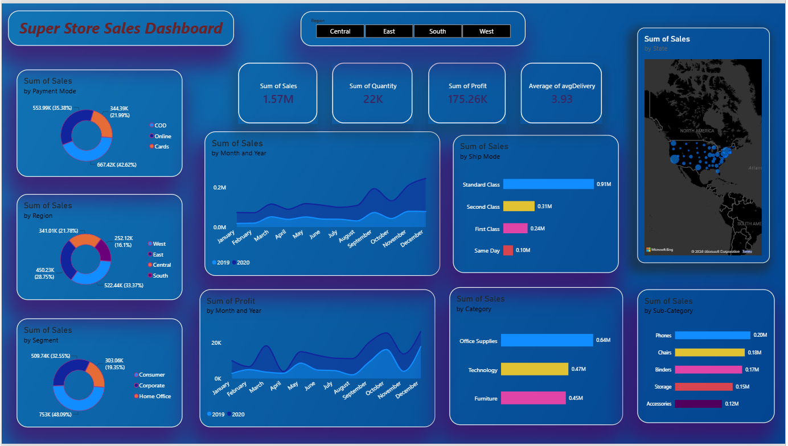
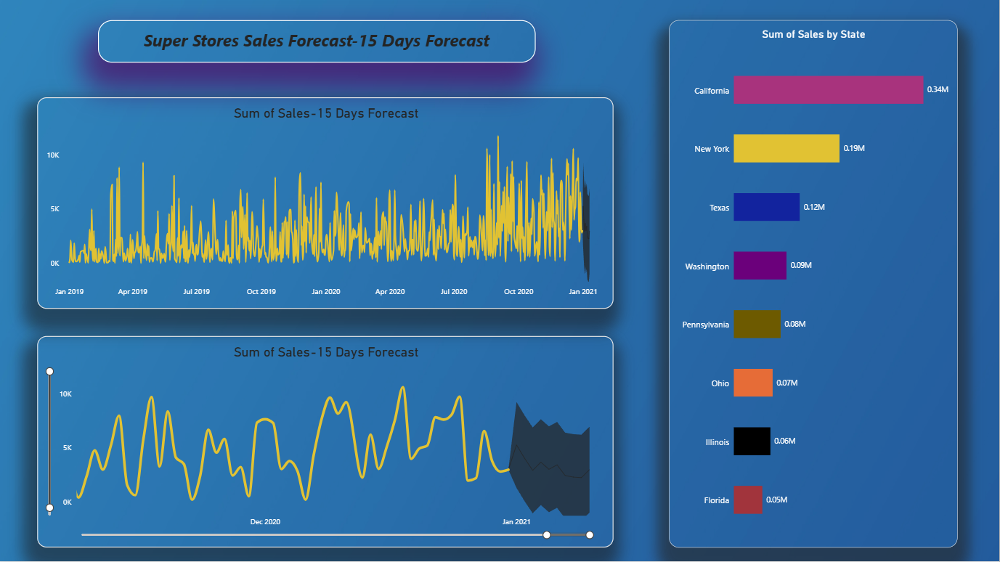

# Super Store Sales Dashboard Project Report

## 📊 Project Overview
This project is a Power BI dashboard created to analyze Super Store sales data.

The dashboard helps understand sales, profit, customers, products, categories, and regional performance.

## 🛠️ Tools Used
- Power BI
- Excel / CSV
- Data Visualization
- Data Analysis

## 📌 Dashboard Features
- Total Sales
- Total Profit
- Sales by Category
- Sales by Sub-Category
- Sales by Region
- Sales by Segment
- Monthly Sales Trends
- Profit Analysis
- Interactive Filters and Slicers

## 📈 Key Insights
The dashboard provides an interactive view of sales and profit performance and helps identify important trends across categories, regions, and products.

## 🖼️ Dashboard Preview

## 🎯 Objective
The objective of this project is to transform sales data into an interactive dashboard that supports data-driven analysis and decision-making.

## 👩‍💻 Created By
Shirisha Bashamoni
